## Hi there 👋

I'm mostly familiar with programming languages like C++, C. 
Also trying to learn Kotlin with Jetpack Compose a bit now. 

A project I'm currently working on is a Unofficial AniList Tracker in C++ and Qt. [More...](https://github.com/x8laye4r/AniLex)

 

<!--
**x8laye4r/x8laye4r** is a ✨ _special_ ✨ repository because its `README.md` (this file) appears on your GitHub profile.

Here are some ideas to get you started:

- 🔭 I’m currently working on ...
- 🌱 I’m currently learning ...
- 👯 I’m looking to collaborate on ...
- 🤔 I’m looking for help with ...
- 💬 Ask me about ...
- 📫 How to reach me: ...
- 😄 Pronouns: ...
- ⚡ Fun fact: ...
-->
